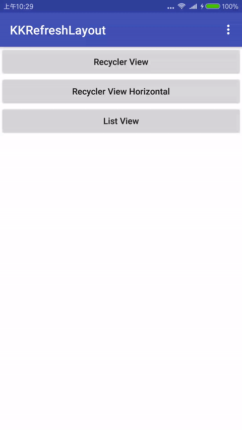
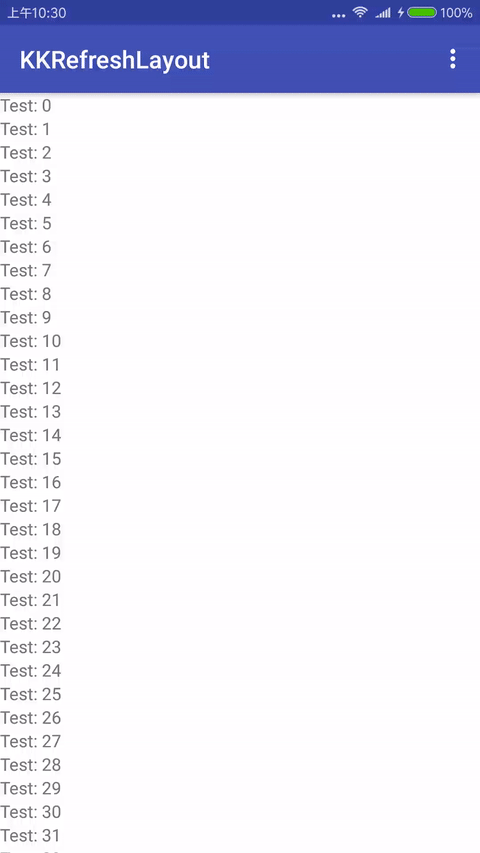

# KKRefreshLayout

The KKRefreshLayout should be used whenever the user can refresh the contents of a view via a vertical/horizontal swipe gesture.
And support custom design header and footer view.


## Sample
 

## Set-up

### Download
Download [the latest aar](https://github.com/0kai/KKRefreshLayout/releases) or grab via Gradle:
```groovy
support later
```
or Maven:
```xml
support later
```

### Layout
```xml
<net.z0kai.refreshlayout.KKRefreshLayout
    android:id="@+id/refreshLayout"
    android:layout_width="match_parent"
    android:layout_height="match_parent"
    app:rlLoadMoreEnable="true">
    // one child view
</net.z0kai.refreshlayout.KKRefreshLayout>
```

### Listener
```java
refreshLayout.setRefreshListener(new KKRefreshListener() {
    @Override
    public void onRefresh() {
    }

    @Override
    public void onLoadMore() {
    }
});
```

### Customization
You can custom header/footer view for your app by implements [IHeaderView](library/src/main/java/net/z0kai/refreshlayout/view/IHeaderView.java)/[IFooterView](library/src/main/java/net/z0kai/refreshlayout/view/IFooterView.java).
And config for all refresh layout in your app, see [KKRefreshLayoutConfig](library/src/main/java/net/z0kai/refreshlayout/KKRefreshLayoutConfig.java).
```java
// only for vertical
KKRefreshLayoutConfig.setHeaderViewProvider(yourView);
KKRefreshLayoutConfig.setFooterViewProvider(yourView);
```
or set header/footer view activity onCreate
```java
refreshLayout.setHeaderView(new EmptyHeaderView(this));
refreshLayout.setFooterView(new ArrowFooterView(this));
```

## Author
Z0Kai, @0kai on GitHub, [blog-中文](http://www.0kai.net)

## License
MIT-licensed.
