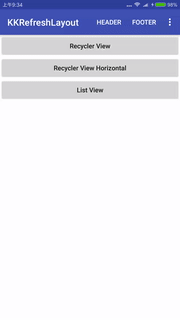
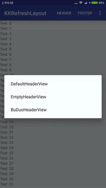
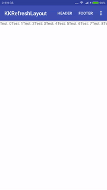

# KKRefreshLayout

[  ](https://bintray.com/0kai/maven/KKRefreshLayout/_latestVersion)

> 一个下拉刷新框架。已有很多开源刷新工具，但是还找到一个方便自定义，可扩展的。所以自己造个轮子。
还是先写个中文文档就好了. [English Doc](README-EN.md)
- 支持自定义下拉/上拉动画
- 支持无数据时上拉显示"没有更多"(可自定义)
- 支持显示满屏的加载动画（如首次没有数据的动画）
- 支持滑动到底部，自动加载
- 支持横向/纵向刷新


## Set-up

Gradle:
```groovy
compile 'net.z0kai:kkrefreshlayout:x.x.x'
```
or Maven:
```xml
<dependency>
  <groupId>net.z0kai</groupId>
  <artifactId>kkrefreshlayout</artifactId>
  <version>x.x.x</version>
  <type>pom</type>
</dependency>
```
### Demo [apk下载](static/app-release.apk)
目前遇到的使用案例大部分都会添加到demo中
- 各种动画刷新
- 第一次进入页面没数据需要一个加载动画
- 横向弹性跳转更多页面
- 页面上下拉弹性滑动（像iOS弹性效果）
- 如微信各种中心也，一半图片下拉回弹效果

### 使用方式
推荐自己集成于KKRefreshLayout如下(全局使用)，然后可以自定义刷新样式。若不继承则使用默认样式。

```java
/**
 * Created by Z_0Kai on 16/9/30.
 * APP封装新控件,请尽量不要使用到原来刷新控件的接口,封装后方便替换
 */
public class AppRefreshLayout extends KKRefreshLayout {

    private AppRefreshLayoutListener mListener;
    
    // ... see demo
    
    public interface AppRefreshLayoutListener {
        void onRefresh();

        void onLoadMore();
    }

    public static class AppRefreshLayoutAdapter implements AppRefreshLayoutListener {
        public void onRefresh() {
        }

        public void onLoadMore() {
        }
    }

    public void setRefreshLayoutListener(AppRefreshLayoutListener listener) {
        mListener = listener;

        super.setRefreshListener(new KKRefreshListener() {
            @Override
            public void onRefresh() {
                if (mListener != null) {
                    mListener.onRefresh();
                }
            }

            @Override
            public void onLoadMore() {
                if (mListener != null) {
                    mListener.onLoadMore();
                }
            }
        });
    }

    /**
     * @hide
     * @deprecated
     */
    @Override
    public void setRefreshListener(KKRefreshListener listener) {
        super.setRefreshListener(listener);
    }
}

```

- ```obtainHeaderView``` 自定义顶部刷新样式
- ```obtainFooterView``` 自定义上拉样式
- ```obtainPageView``` 自定义页面刷新样式（无默认）

### 也可以在界面create的时候单独设置
- ```setHeadView``` 设置下拉刷新样式
- ```setFooterView``` 设置上拉加载样式
- ```setPageView``` 设置页面加载效果


### 布局
```xml
<net.z0kai.kkrefreshlayout.KKRefreshLayout
    android:id="@+id/refreshLayout"
    android:layout_width="match_parent"
    android:layout_height="match_parent"
    app:rlLoadMoreEnable="true">
    // one child view
</net.z0kai.kkrefreshlayout.KKRefreshLayout>
```

### 布局中设置属性
- ```app:rlOrientation="horizontal/vertical"``` 横向纵向刷新
- ```app:rlRefreshEnable="true/false"``` 是否可下拉刷新
- ```app:rlLoadMoreEnable="true/false"``` 是否加载更多
- 

### Listener
```java
onRefresh()
onLoadMore()
```

## 贡献你的刷新样式
> 欢迎提交自定义的Header/Footer/PageView到demo中，添加class到
[AppConfigs.java](app/src/main/java/net/z0kai/kkrefreshlayout_demo/AppConfigs.java)

  

## 使用本库的APP
-  [我在家⬇️](http://android.myapp.com/myapp/detail.htm?apkName=com.buduobushao.android.webclient)

## Author
Z0Kai, @0kai on GitHub, [blog-中文](http://www.0kai.net)

## License
MIT-licensed.
